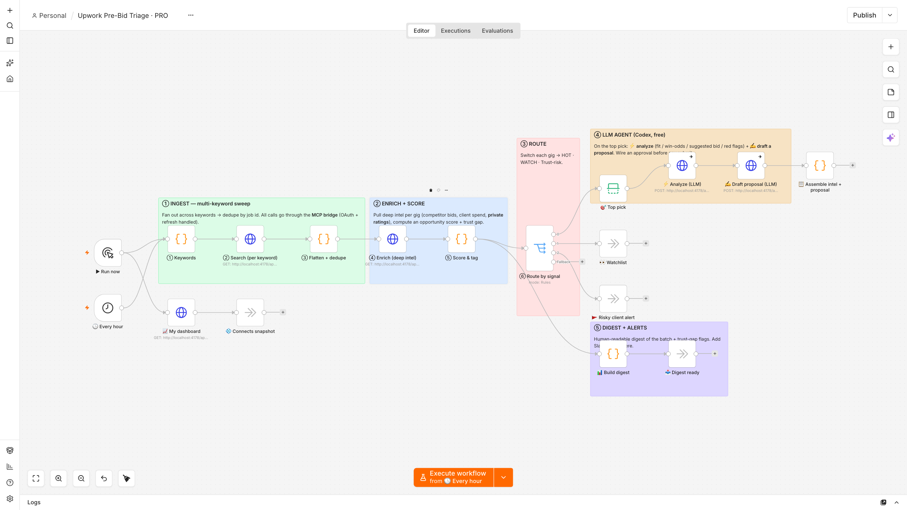
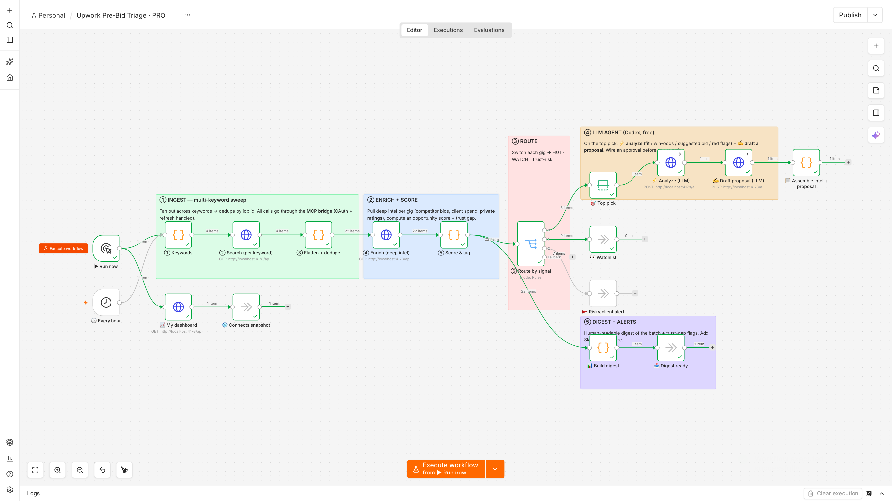
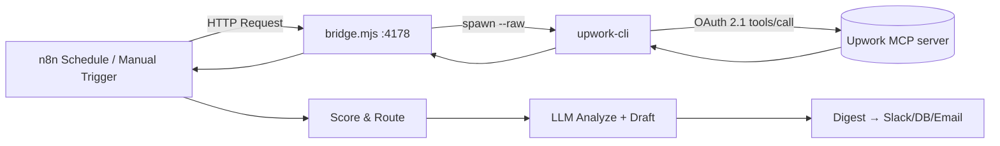

# Upwork n8n Automation — AI Job Triage, Scoring & Proposal Drafting

> **Automate Upwork job hunting in n8n using the official Upwork MCP server.** This ready-to-import n8n workflow searches Upwork jobs on a schedule, pulls premium market intel (competitor bid ranges, client lifetime spend, hire history), scores every gig, and writes an AI proposal for the best match — hands-free.

<p align="center">
  
</p>

**Keywords:** Upwork n8n automation · Upwork MCP · n8n Upwork integration · automate Upwork bidding · AI Upwork proposal writer · Upwork job scraper alternative · Model Context Protocol · Upwork API workflow · freelance automation.

---

## What this does

A self-hosted n8n pipeline that runs your entire **pre-bid routine** automatically:

1. **Search** Upwork across several keywords on a schedule (or on demand).
2. **Enrich** each job with data usually gated behind Upwork's premium tiers — **competitor bid ranges, client lifetime spend, contract count, feedback score, and connects cost**.
3. **Score & tag** every job (HOT / WATCH / SKIP) from those real numbers.
4. **Route** by signal, then let an **LLM analyze the top pick and draft a tailored proposal**.
5. **Assemble a digest** you can pipe to Slack, email, Notion, or a database.

No scraping, no brittle selectors — it reads the **official [Upwork MCP server](https://mcp.upwork.com/mcp)** through [`upwork-cli`](../../), which handles OAuth 2.1 for you.

<p align="center">
  
</p>

---

## Architecture



n8n's HTTP node speaks REST, not MCP's `tools/call` envelope. **`bridge.mjs`** is a tiny, dependency-free shim that turns the MCP into clean JSON endpoints and hides the OAuth + `content[0].text` unwrap quirk.

---

## Quick start (3 steps)

```bash
# 1. Clone + install the CLI, then log in to Upwork (opens your browser once)
git clone https://github.com/Majboor/upwork-cli && cd upwork-cli
npm install && node bin/upwork.js login

# 2. Start the bridge (defaults to http://localhost:4178)
node examples/n8n/bridge.mjs
#   Optional AI proposals: LLM_CMD=codex node examples/n8n/bridge.mjs

# 3. In n8n → Workflows → Import from File → pick one:
#      examples/n8n/upwork-triage-starter.json   (simple: search → enrich → score)
#      examples/n8n/upwork-triage-pro.json        (full: multi-keyword + AI analyze + draft)
#   Then click "Execute workflow".
```

That's it — the workflow's HTTP nodes already point at `http://localhost:4178`.

---

## The two workflows

| File | What it does | Best for |
|------|--------------|----------|
| **`upwork-triage-starter.json`** | Search → split → enrich → score → "worth opening" filter | Understanding the pattern; a fast daily shortlist |
| **`upwork-triage-pro.json`** | 4-keyword search → flatten + dedupe → enrich → score & tag → **Switch route** (HOT / WATCH / trust-risk) → **LLM analyze** the top pick → **LLM draft** a proposal → assemble digest + dashboard | Running your real pre-bid routine end to end |

### PRO workflow, node by node

1. **▶ Run now / 🕒 Hourly** — manual + schedule triggers.
2. **① Keywords** — fan out over your target search terms.
3. **② Search per keyword** — `GET /api/search`.
4. **③ Flatten + dedupe** — one clean job list, no repeats.
5. **④ Enrich** — `GET /api/job?id=` for competitor bids + client history.
6. **⑤ Score & tag** — Alpha Score + Trust Gap → HOT / WATCH / SKIP.
7. **⑥ Route by signal** — `Switch` on the tag.
8. **🎯 Top pick → ⚡ Analyze → ✍ Draft** — `POST /api/analyze` then `POST /api/draft`.
9. **📊 Digest / 📈 Dashboard** — assemble the summary to send anywhere.

The two LLM nodes use `onError: continueRegularOutput`, so a slow or missing model never breaks the run — the bridge falls back to a heuristic.

---

## Bridge API reference

| Method | Endpoint | Returns |
|--------|----------|---------|
| `GET` | `/api/health` | `{ ok, cli, loggedIn, account }` |
| `GET` | `/api/search?q=&type=&limit=` | `{ jobs: [ … ] }` — live job search |
| `GET` | `/api/job?id=` | `{ job }` — competitor bids, client spend, trust gap, connects cost |
| `GET` | `/api/dashboard` | `{ connects, matchingJobs, activeContracts, … }` |
| `POST` | `/api/analyze` `{id}` | `{ analysis }` — fit / win-odds / suggested bid / red flags |
| `POST` | `/api/draft` `{id}` | `{ draft }` — a ready-to-send proposal cover letter |

---

## Customize it

- **Keywords** — edit the *① Keywords* node's list.
- **Schedule** — change the *🕒 Hourly* trigger interval.
- **Scoring** — tweak the *⑤ Score & tag* Code node (Alpha Score = spend-log × low-competition × bid-headroom).
- **Delivery** — swap the digest tail for a Slack, Gmail, Notion, or Postgres node.
- **Your own LLM** — set `LLM_CMD` (any CLI that takes a prompt arg and prints text), or point the `/api/analyze` + `/api/draft` nodes at an OpenAI/Anthropic node instead.

---

## FAQ

**Is this against Upwork's terms?** It uses Upwork's **own official MCP server** with your authenticated account — the same data you'd see logged in. It doesn't scrape HTML. Automate responsibly and within Upwork's rules.

**Do I need an API key for the AI parts?** No. The bridge shells out to a local model CLI (`LLM_CMD`). Without one it still runs and returns a deterministic heuristic.

**Can I use n8n Cloud?** The bridge runs on your machine, so point n8n at a reachable URL (e.g. a tunnel) or self-host n8n on the same box.

**Where do my Upwork tokens live?** In `~/.upwork-cli/` — never in the repo or the workflow JSON.

---

Part of [**upwork-cli**](../../) — an OAuth wrapper over the official Upwork MCP (reads + writes) for scripts, dashboards, and automations.
